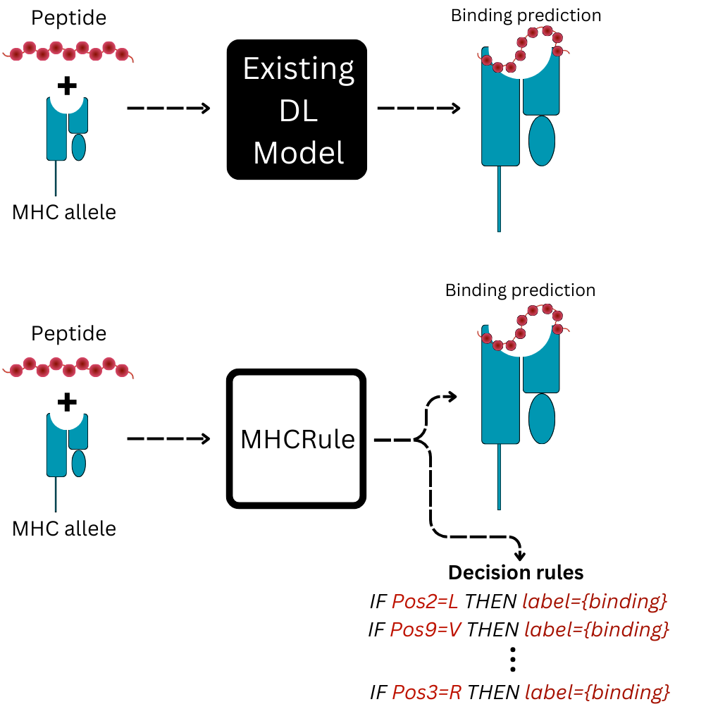

<div align="center">
  
</div>

<div align="center">
  <em>Rule-based Model for Interpretable MHC Class I Binding Prediction.</em>
</div>

 <p align="center">
  <a href="#Introduction">Introduction</a> •
  <a href="#Requirements">Requirements</a> •
  <a href="#Usage">Usage</a> •
  <a href="#Directory-Structure">Directory Structure</a> •
  <a href="#license">License</a> 
</p>

---
## Introduction

Existing predictors for MHC-I binding are predominantly deep learning-based  that are highly accurate but lack interpretability. MHCRule offers both MHC-I binding prediction and interpretable rules, enhancing trust in these predictions.

MHCRuleHydroPep is a model consisting of two submodules - MHCRulePepOnly and MHCRuleHydro. MHCRulePepOnly contains rules per allele generated using peptide sequence while MHCRuleHydro generates rules for peptide sequence encoded using a hydrophobicity scale.

<div align="center">
  
  
</div>

---
## Requirements

For this project, we used <a href="[./requirements.txt](https://github.com/adaa-polsl/RuleKit-python)">  RuleKit-Python</a> package for generating contrast set rules. 

For running the code, we use Python version - 3.9

See <a href="./requirements.txt"> requirements.txt</a> for the list of python packages.

---
## Usage
See <a href="./USAGE EXAMPLE.ipynb"> USAGE EXAMPLE.ipynb</a>

---
## Directory Structure

| File/Folder | Description |
| ----------- | ----------- |
| Data | Folder containing data needed for project |
| figures | Folder containing result figures for paper |
| hyperopts | Folder containing results for hyperparameter tuning |
| model | Folder containing trained MHCRule models |
| notebooks | Folder containing experiments ipynbs  |
| results | Folder containing results for training and independent dataset evaluation |
| src | Folder containing  code needed for MHCRule|
| USAGE EXAMPLE.ipynb | Jupyter notebook demonstrating usage of MHCRule |


```bash
tree -L 2

.
├── Data
│   ├── allele_seq_IPD_IMGT.fasta
│   ├── Data_HLA.csv
│   ├── Data_S3.csv
│   ├── difflogo_results.csv
│   ├── diffmotif_predicted_data_results_calculated.csv
│   ├── diffmotif_training_data_results_calculated.csv
│   ├── HLA_peptide_count.csv
│   ├── hla_precomputed.csv
│   ├── HLA_seqs_of_interest.csv
│   ├── MHC-Bench_v2.csv
│   ├── mhcbench_v2_predictors_AUPRC.csv
│   └── mhcbench_v2_predictors_AUROC.csv
├── figures
│   ├── Benchmark
│   ├── EDA
│   ├── generalization
│   ├── hyperopts
│   ├── learned_profiles
│   ├── Logo.png
│   ├── MHCRuleHydroPep.png
│   ├── MHCRule.png
│   └── rule_conditions
├── hyperopts
│   ├── 1 - Hyperparameter tuning.ipynb
│   ├── 2 - Hyperparameter tuning A*0201.ipynb
│   ├── grid.csv
│   └── hyperopts_result.csv
├── __init__.py
├── model
│   ├── MHCRuleHydroPep.pkl
│   ├── MHCRuleHydro.pkl
│   ├── MHCRulePepHLA.pkl
│   └── MHCRulePepOnly.pkl
├── notebooks
│   ├── 1 - EDA original data.ipynb
│   ├── 1a - EDA final training data.ipynb
│   ├── 2 - HLA sequences.ipynb
│   ├── 3a - MHCRulePepHLA.ipynb
│   ├── 3b - MHCRulePepOnly.ipynb
│   ├── 3c - MHCRuleHydro.ipynb
│   ├── 3d - MHCRuleHydroPep.ipynb
│   ├── 4 - Benchmark.ipynb
│   ├── 5 - Learning patterns for alleles.ipynb
│   ├── 6 - Attribute focus of rule conditions.ipynb
│   ├── 7 - Generalization capacity.ipynb
│   └── __init__.py
├── README.md
├── requirements.txt
├── results
│   ├── MHCRule
│   └── PWM
├── src
│   ├── __init__.py
│   ├── MHCRule.py
│   ├── utils.py
│   └── utils_rules.py
└── USAGE EXAMPLE.ipynb
```


