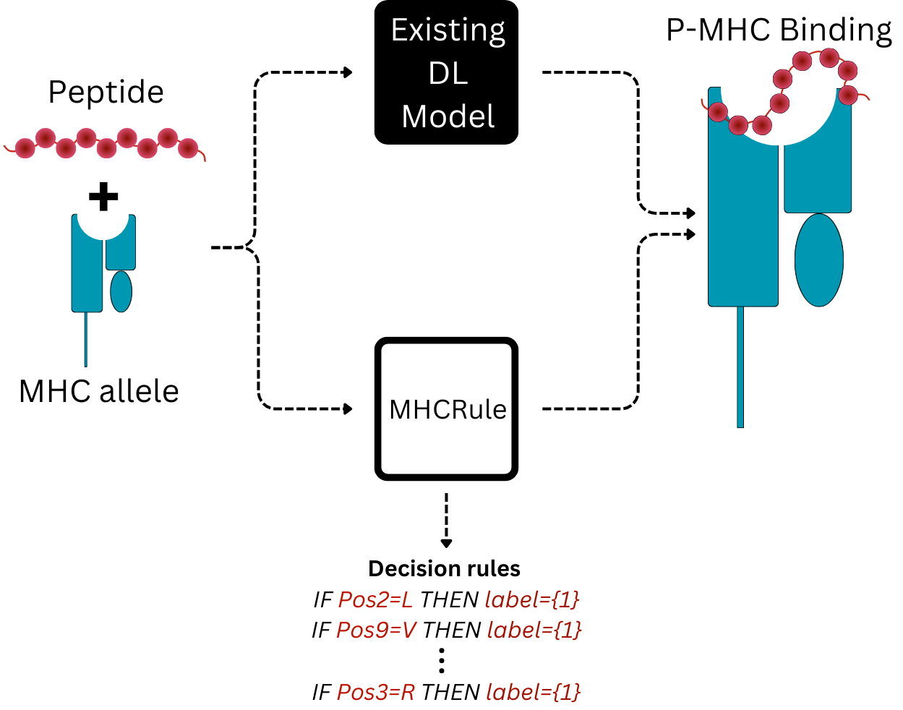
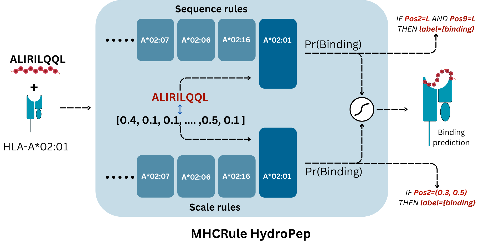

# MHCRule
Rule-based Model for Interpretable MHC Class I Binding Prediction.
 
## Introduction

Existing predictors for MHC-I binding are predominantly deep learning-based  that are highly accurate but lack interpretability. MHCRule offers both MHC-I binding prediction and interpretable rules, enhancing trust in these predictions.

MHCRuleHydroPep is a model consisting of two submodules - MHCRulePepOnly and MHCRuleHydro. MHCRulePepOnly contains rules per allele generated using peptide sequence while MHCRuleHydro generates rules for peptide sequence encoded using a hydrophobicity scale.

  
  

## Requirements

#### Dataset sources

## Usage
See USAGE EXAMPLE.ipynb

## Directory Structure and Content

